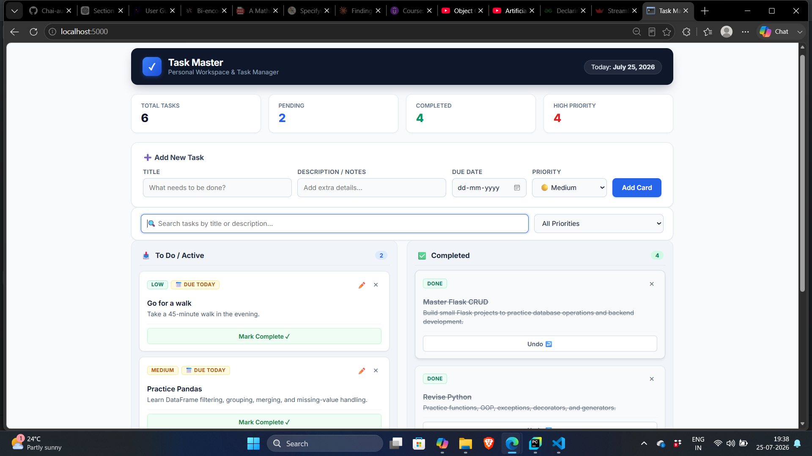
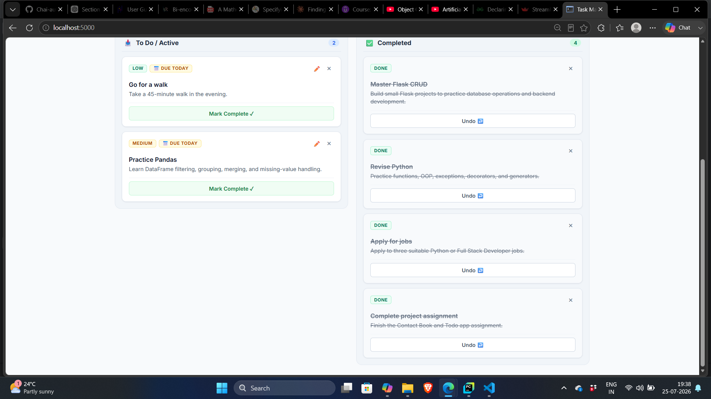

# Task Master

> A modern Flask-based task management dashboard for creating, organizing, tracking, and completing daily tasks.


---

## 📌 Overview

**Task Master** is a full-stack task management web application built with **Python, Flask, SQLAlchemy, SQLite, Jinja2, HTML, CSS, and Vanilla JavaScript**.

The application helps users organize their daily work by creating tasks, assigning priorities, setting due dates, tracking completion status, editing task information, and deleting tasks when they are no longer needed.

The dashboard provides a clear overview of task progress and includes client-side search and filtering functionality for quickly finding tasks without requiring a page reload.

---

## 📸 Screenshots

### Task Master Dashboard



### Task Management Interface



---

## ✨ Features

### 📊 Dashboard Statistics

The dashboard provides live task statistics, including:

- Total number of tasks
- Active tasks
- Completed tasks
- High-priority tasks

---

### 📋 Task Management

Users can:

- Create new tasks
- View all saved tasks
- Edit existing task details
- Mark tasks as completed
- Undo completed tasks
- Delete tasks

---

### 🎯 Priority Management

Each task can have one of three priority levels:

- 🔴 High
- 🟡 Medium
- 🟢 Low

This helps users organize tasks based on importance.

---

### 🗓️ Due Date Tracking

Tasks can have optional due dates.

The application displays different statuses for tasks:

- **Overdue**
- **Due Today**
- **Upcoming**
- **No Due Date**

This helps users keep track of deadlines.

---

### ⚡ Search and Filtering

The application includes client-side filtering using Vanilla JavaScript.

Users can:

- Search tasks by title or description
- Filter tasks by priority
- Instantly see matching tasks without reloading the page

---

### ✏️ Modal-Based Editing

Tasks can be edited through a modal interface.

Users can update:

- Task title
- Description
- Priority
- Due date

---

### 🎨 Responsive User Interface

The interface includes:

- Responsive layout
- CSS variables
- Flexbox
- CSS Grid
- Interactive buttons
- Hover effects
- Smooth transitions
- Clean dashboard design

---

## 🛠️ Tech Stack

### Backend

- **Python 3.10+**
- **Flask**
- **Flask-SQLAlchemy**
- **SQLAlchemy 2.0**

### Database

- **SQLite**

### Frontend

- **HTML5**
- **CSS3**
- **Jinja2**
- **Vanilla JavaScript (ES6+)**

---

## 🗄️ Database Model

The application uses a `Todo` model with the following fields:

| Field | Type | Description |
|---|---|---|
| `id` | Integer | Unique task identifier |
| `title` | String | Task title |
| `description` | String | Additional task details |
| `priority` | String | Low, Medium, or High |
| `completed` | Boolean | Tracks whether the task is completed |
| `due_date` | Date | Optional task deadline |

---

## 🔄 CRUD Operations

The application implements complete CRUD functionality.

| Operation | Description |
|---|---|
| **Create** | Add a new task |
| **Read** | Display all saved tasks |
| **Update** | Edit task details and toggle completion |
| **Delete** | Remove a task |

---

## 🔗 Application Routes

| Route | Method | Description |
|---|---|---|
| `/` | `GET` | Display all tasks |
| `/add` | `POST` | Create a new task |
| `/edit/<task_id>` | `POST` | Update an existing task |
| `/toggle/<task_id>` | `POST` | Toggle task completion |
| `/delete/<task_id>` | `POST` | Delete a task |

---

## 📁 Project Structure

```text
todo-task-manager-flask/
│
├── instance/
│   └── todo.db              # Local SQLite database (ignored by Git)
│
├── screenshots/
│   ├── task_manager.png
│   └── tasks.png
│
├── static/
│   ├── script.js            # Search, filtering, and modal logic
│   └── style.css            # Application styling
│
├── templates/
│   └── index.html           # Main dashboard template
│
├── .gitignore               # Ignored files and folders
├── main.py                  # Flask application and database logic
├── README.md                # Project documentation
└── requirements.txt         # Python dependencies
